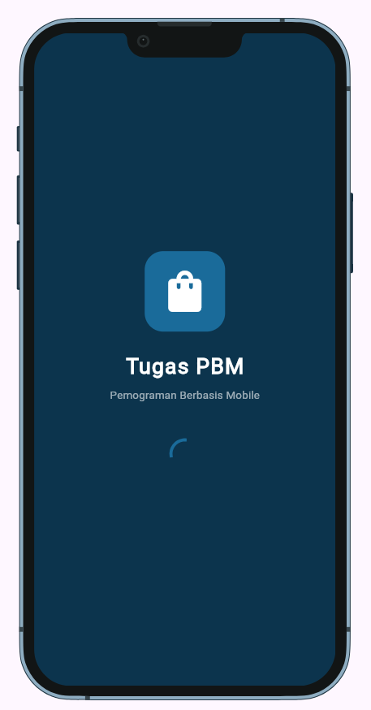
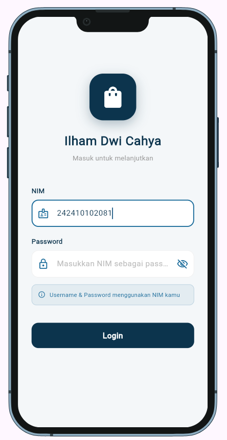
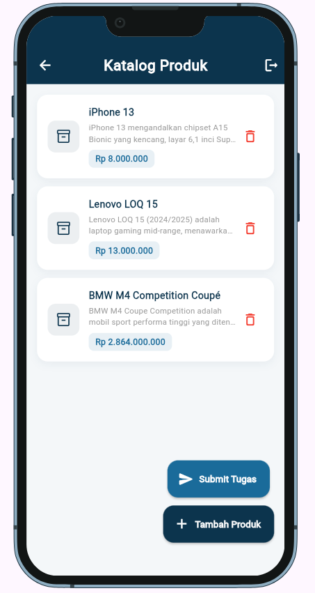
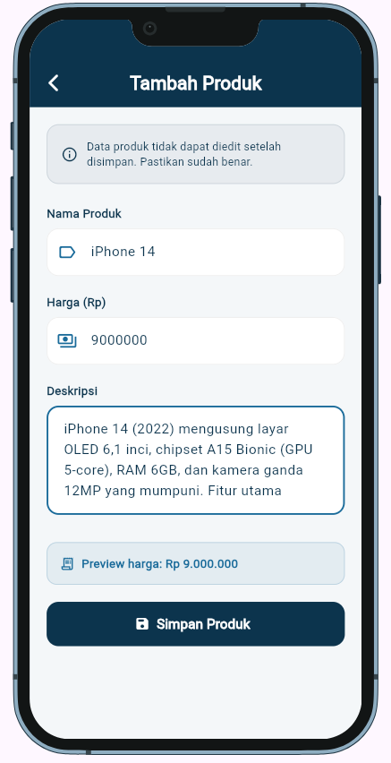
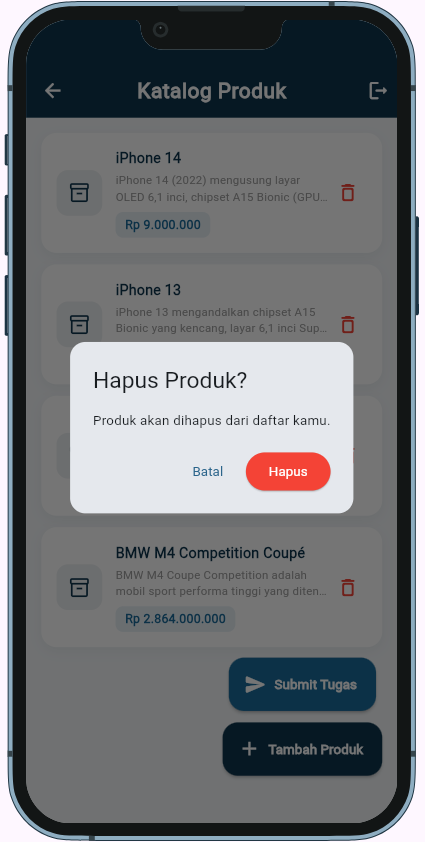
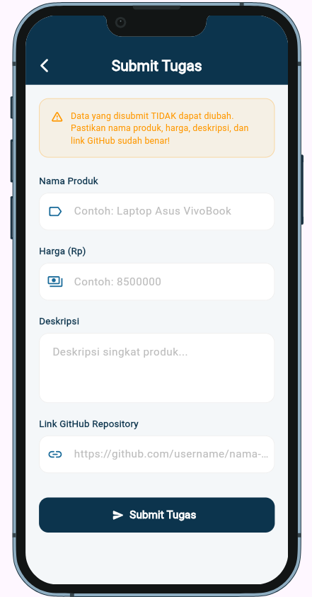
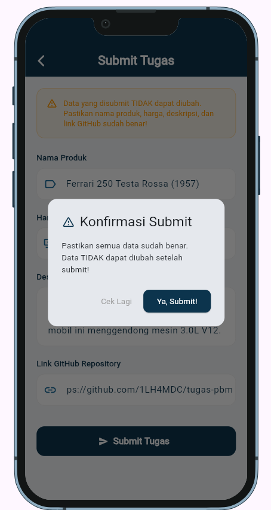
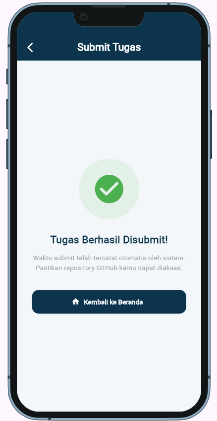

# Tugas Praktikum PBM 2026
**Nama** : Ilham Dwi Cahya  
**NIM**  : 242410102081  
**Kelas** : PBM B 

---

## 📱 Deskripsi Aplikasi

Aplikasi Flutter katalog produk yang terintegrasi dengan REST API.  
Fitur utama:
- Login menggunakan NIM sebagai username dan password
- Melihat daftar produk milik sendiri
- Menambahkan produk baru ke katalog
- Menghapus produk (soft delete)
- Submit tugas ke sistem praktikum

---

## 📸 Screenshot Aplikasi

### Splash Screen

### Login Screen

### Home Screen

### Tambah Produk

### Hapus Produk (salah satu contoh konfirmasi)

### Submit Tugas

### Submit Tugas

### Submit Tugas berhasil

---

## 🗂️ Struktur Project
lib/
├── main.dart
├── models/
│   ├── user_model.dart
│   └── product_model.dart
├── services/
│   └── api_service.dart
├── screens/
│   ├── login_screen.dart
│   ├── home_screen.dart
│   ├── add_product_screen.dart
│   └── submit_screen.dart
└── utils/
└── constants.dart